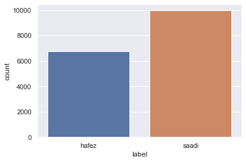

<h1>Table of Contents<span class="tocSkip"></span></h1>
<div class="toc"><ul class="toc-item"><li><span><a href="#Introduction" data-toc-modified-id="Introduction-1"><span class="toc-item-num">1&nbsp;&nbsp;</span>Introduction</a></span></li><li><span><a href="#Exploring-Data" data-toc-modified-id="Exploring-Data-2"><span class="toc-item-num">2&nbsp;&nbsp;</span>Exploring Data</a></span><ul class="toc-item"><li><span><a href="#Meet-and-Greet-Data" data-toc-modified-id="Meet-and-Greet-Data-2.1"><span class="toc-item-num">2.1&nbsp;&nbsp;</span>Meet and Greet Data</a></span></li><li><span><a href="#Split-Train-set-and-Test-set" data-toc-modified-id="Split-Train-set-and-Test-set-2.2"><span class="toc-item-num">2.2&nbsp;&nbsp;</span>Split Train set and Test set</a></span></li><li><span><a href="#Exploring-Labels" data-toc-modified-id="Exploring-Labels-2.3"><span class="toc-item-num">2.3&nbsp;&nbsp;</span>Exploring Labels</a></span></li></ul></li><li><span><a href="#Feature-Engineering" data-toc-modified-id="Feature-Engineering-3"><span class="toc-item-num">3&nbsp;&nbsp;</span>Feature Engineering</a></span><ul class="toc-item"><li><span><a href="#Normalize" data-toc-modified-id="Normalize-3.1"><span class="toc-item-num">3.1&nbsp;&nbsp;</span>Normalize</a></span></li><li><span><a href="#Tokeninzing" data-toc-modified-id="Tokeninzing-3.2"><span class="toc-item-num">3.2&nbsp;&nbsp;</span>Tokeninzing</a></span></li><li><span><a href="#Add-Words-Position" data-toc-modified-id="Add-Words-Position-3.3"><span class="toc-item-num">3.3&nbsp;&nbsp;</span>Add Words Position</a></span></li><li><span><a href="#Delete-Small-Tokens" data-toc-modified-id="Delete-Small-Tokens-3.4"><span class="toc-item-num">3.4&nbsp;&nbsp;</span>Delete Small Tokens</a></span></li><li><span><a href="#Length-of-Hemistichs" data-toc-modified-id="Length-of-Hemistichs-3.5"><span class="toc-item-num">3.5&nbsp;&nbsp;</span>Length of Hemistichs</a></span></li><li><span><a href="#Lemmatizing" data-toc-modified-id="Lemmatizing-3.6"><span class="toc-item-num">3.6&nbsp;&nbsp;</span>Lemmatizing</a></span></li><li><span><a href="#Stemming" data-toc-modified-id="Stemming-3.7"><span class="toc-item-num">3.7&nbsp;&nbsp;</span>Stemming</a></span></li><li><span><a href="#Existance-Matrix" data-toc-modified-id="Existance-Matrix-3.8"><span class="toc-item-num">3.8&nbsp;&nbsp;</span>Existance Matrix</a></span></li></ul></li><li><span><a href="#Creating-Pipeline" data-toc-modified-id="Creating-Pipeline-4"><span class="toc-item-num">4&nbsp;&nbsp;</span>Creating Pipeline</a></span></li><li><span><a href="#Train-Naive-Bayes-Model-And-How-It-Works" data-toc-modified-id="Train-Naive-Bayes-Model-And-How-It-Works-5"><span class="toc-item-num">5&nbsp;&nbsp;</span>Train Naive Bayes Model And How It Works</a></span><ul class="toc-item"><li><span><a href="#Scores-for-Hafez" data-toc-modified-id="Scores-for-Hafez-5.1"><span class="toc-item-num">5.1&nbsp;&nbsp;</span>Scores for <code>Hafez</code></a></span></li><li><span><a href="#Scores-for-Saadi" data-toc-modified-id="Scores-for-Saadi-5.2"><span class="toc-item-num">5.2&nbsp;&nbsp;</span>Scores for <code>Saadi</code></a></span></li><li><span><a href="#Accuracy" data-toc-modified-id="Accuracy-5.3"><span class="toc-item-num">5.3&nbsp;&nbsp;</span>Accuracy</a></span></li></ul></li><li><span><a href="#Evalute-Model" data-toc-modified-id="Evalute-Model-6"><span class="toc-item-num">6&nbsp;&nbsp;</span>Evalute Model</a></span></li><li><span><a href="#Questions" data-toc-modified-id="Questions-7"><span class="toc-item-num">7&nbsp;&nbsp;</span>Questions</a></span></li></ul></div>

# Computer Assignment 3
**Farzad Habibi - 810195383**


## Introduction
In this computer assignment we are going to classify peoms by two peots of iran (Hafez and Saadi). We use Navie Bayes model to classify them and also use two methodolgy to make features from peoms.


## Exploring Data

###  Meet and Greet Data
At first we read data from our csv files. Then try see their data.


```python
import numpy as np
import pandas as pd
import os
DATA_FOLDER = './Data'
TRAIN_SET = 'train_test.csv'
EVALUATE = 'evaluate.csv'
train_set = pd.read_csv(os.path.join(DATA_FOLDER, TRAIN_SET))
evaluate_set = pd.read_csv(os.path.join(DATA_FOLDER, EVALUATE), index_col='id')
```


```python
train_set.head()
```


<div>
<style scoped>
    .dataframe tbody tr th:only-of-type {
        vertical-align: middle;
    }

    .dataframe tbody tr th {
        vertical-align: top;
    }

    .dataframe thead th {
        text-align: right;
    }
</style>
<table border="1" class="dataframe">
  <thead>
    <tr style="text-align: right;">
      <th></th>
      <th>text</th>
      <th>label</th>
    </tr>
  </thead>
  <tbody>
    <tr>
      <th>0</th>
      <td>چون می‌رود این کشتی سرگشته که آخر</td>
      <td>hafez</td>
    </tr>
    <tr>
      <th>1</th>
      <td>که همین بود حد امکانش</td>
      <td>saadi</td>
    </tr>
    <tr>
      <th>2</th>
      <td>ارادتی بنما تا سعادتی ببری</td>
      <td>hafez</td>
    </tr>
    <tr>
      <th>3</th>
      <td>خدا را زین معما پرده بردار</td>
      <td>hafez</td>
    </tr>
    <tr>
      <th>4</th>
      <td>گویی که در برابر چشمم مصوری</td>
      <td>saadi</td>
    </tr>
  </tbody>
</table>
</div>


```python
evaluate_set.head()
```


<div>
<style scoped>
    .dataframe tbody tr th:only-of-type {
        vertical-align: middle;
    }

    .dataframe tbody tr th {
        vertical-align: top;
    }

    .dataframe thead th {
        text-align: right;
    }
</style>
<table border="1" class="dataframe">
  <thead>
    <tr style="text-align: right;">
      <th></th>
      <th>text</th>
    </tr>
    <tr>
      <th>id</th>
      <th></th>
    </tr>
  </thead>
  <tbody>
    <tr>
      <th>1</th>
      <td>ور بی تو بامداد کنم روز محشر است</td>
    </tr>
    <tr>
      <th>2</th>
      <td>ساقی بیار جامی کز زهد توبه کردم</td>
    </tr>
    <tr>
      <th>3</th>
      <td>مرا هرآینه خاموش بودن اولی‌تر</td>
    </tr>
    <tr>
      <th>4</th>
      <td>تو ندانی که چرا در تو کسی خیره بماند</td>
    </tr>
    <tr>
      <th>5</th>
      <td>کاینان به دل ربودن مردم معینند</td>
    </tr>
  </tbody>
</table>
</div>


```python
train_set.info()
```

    <class 'pandas.core.frame.DataFrame'>
    RangeIndex: 20889 entries, 0 to 20888
    Data columns (total 2 columns):
    text     20889 non-null object
    label    20889 non-null object
    dtypes: object(2)
    memory usage: 326.5+ KB


As you see all columns are not null. So we don't need to impute this columns and we can use their data without any impution.

### Split Train set and Test set
For this goal first of all we shuffle our data and split data into two part of train and test with split factor of 0.2.


```python
from sklearn.model_selection import train_test_split
X_train, X_test, y_train, y_test = train_test_split(train_set[['text']], train_set['label'], test_size=0.2, random_state=42)
```

### Exploring Labels

Lets see how much of our train data is hafez poetry and how much is saadi poetry. 


```python
import matplotlib.pyplot as plt
import seaborn as sns
sns.set()
```


```python
sns.countplot(x=y_train)
```


    <matplotlib.axes._subplots.AxesSubplot at 0x123174e10>





There is more peotries by saadi in our train_data.

## Feature Engineering

### Normalize 
At first we nomalize our hemistichs with `hazm` library. this library change one words with extra spaces into one words with half-spaces in persian.


```python
from hazm import Normalizer
normalizer = Normalizer()
normalizer.normalize('اصلاح نويسه ها و استفاده از نیم‌فاصله پردازش را آسان مي كند')
```


    'اصلاح نویسه\u200cها و استفاده از نیم\u200cفاصله پردازش را آسان می\u200cکند'


```python
from sklearn.base import TransformerMixin, BaseEstimator
class PeotNormalizer(BaseEstimator, TransformerMixin):
    def __init__(self):
        self.normalizer = Normalizer()
    def fit(self, X, y=None):
        return self
    def transform(self, X, y=None):
        X_copy = X.copy()
        X_copy['text'] = X_copy['text'].apply(self.normalizer.normalize)
        return X_copy
```


```python
X_normalized = PeotNormalizer().fit_transform(X_train)
```

### Tokeninzing

We tokenize our hemistichs into words using word tokenizer in hazm library. 


```python
from hazm import word_tokenize
class PeotTokenizer(BaseEstimator, TransformerMixin):
    def fit(self, X, y=None):
        return self
    def transform(self, X, y=None):
        X_copy = X.copy()
        X_copy['text'] = X_copy['text'].apply(word_tokenize)
        return X_copy
```


```python
X_tokenized = PeotTokenizer().fit_transform(X_normalized)
X_tokenized.head()
```


<div>
<style scoped>
    .dataframe tbody tr th:only-of-type {
        vertical-align: middle;
    }

    .dataframe tbody tr th {
        vertical-align: top;
    }

    .dataframe thead th {
        text-align: right;
    }
</style>
<table border="1" class="dataframe">
  <thead>
    <tr style="text-align: right;">
      <th></th>
      <th>text</th>
    </tr>
  </thead>
  <tbody>
    <tr>
      <th>19075</th>
      <td>[از, چشم, شوخش, ای, دل, ایمان, خود, نگه, دار]</td>
    </tr>
    <tr>
      <th>12549</th>
      <td>[ز, اخترم, نظری, سعد, در, ره, است, که, دوش]</td>
    </tr>
    <tr>
      <th>401</th>
      <td>[هر, کس, حکایتی, به, تصور, چرا, کنند]</td>
    </tr>
    <tr>
      <th>8542</th>
      <td>[مگر, که, لاله, بدانست, بی‌وفایی, دهر]</td>
    </tr>
    <tr>
      <th>19664</th>
      <td>[گوهر, جام, جم, از, کان, جهانی, دگر, است]</td>
    </tr>
  </tbody>
</table>
</div>


### Add Words Position

We can also position of words here.


```python
class PoetPosAdder(BaseEstimator, TransformerMixin):
    def fit(self, X, y=None):
        self.max_nums = np.unique(X['text'].apply(len))
        return self
    def transform(self, X, y=None):
        X_copy = X.copy()
        for i in self.max_nums:
            X_copy[str(i)] = X_copy.apply(lambda row : row['text'][i-1] if len(row['text']) >= i else 0 , axis=1)
        return X_copy
```


```python
X_positioned = PoetPosAdder().fit_transform(X_tokenized)
X_positioned.head()
```


<div>
<style scoped>
    .dataframe tbody tr th:only-of-type {
        vertical-align: middle;
    }

    .dataframe tbody tr th {
        vertical-align: top;
    }

    .dataframe thead th {
        text-align: right;
    }
</style>
<table border="1" class="dataframe">
  <thead>
    <tr style="text-align: right;">
      <th></th>
      <th>text</th>
      <th>1</th>
      <th>2</th>
      <th>3</th>
      <th>4</th>
      <th>5</th>
      <th>6</th>
      <th>7</th>
      <th>8</th>
      <th>9</th>
      <th>10</th>
      <th>11</th>
      <th>12</th>
      <th>13</th>
    </tr>
  </thead>
  <tbody>
    <tr>
      <th>19075</th>
      <td>[از, چشم, شوخش, ای, دل, ایمان, خود, نگه, دار]</td>
      <td>از</td>
      <td>چشم</td>
      <td>شوخش</td>
      <td>ای</td>
      <td>دل</td>
      <td>ایمان</td>
      <td>خود</td>
      <td>نگه</td>
      <td>دار</td>
      <td>0</td>
      <td>0</td>
      <td>0</td>
      <td>0</td>
    </tr>
    <tr>
      <th>12549</th>
      <td>[ز, اخترم, نظری, سعد, در, ره, است, که, دوش]</td>
      <td>ز</td>
      <td>اخترم</td>
      <td>نظری</td>
      <td>سعد</td>
      <td>در</td>
      <td>ره</td>
      <td>است</td>
      <td>که</td>
      <td>دوش</td>
      <td>0</td>
      <td>0</td>
      <td>0</td>
      <td>0</td>
    </tr>
    <tr>
      <th>401</th>
      <td>[هر, کس, حکایتی, به, تصور, چرا, کنند]</td>
      <td>هر</td>
      <td>کس</td>
      <td>حکایتی</td>
      <td>به</td>
      <td>تصور</td>
      <td>چرا</td>
      <td>کنند</td>
      <td>0</td>
      <td>0</td>
      <td>0</td>
      <td>0</td>
      <td>0</td>
      <td>0</td>
    </tr>
    <tr>
      <th>8542</th>
      <td>[مگر, که, لاله, بدانست, بی‌وفایی, دهر]</td>
      <td>مگر</td>
      <td>که</td>
      <td>لاله</td>
      <td>بدانست</td>
      <td>بی‌وفایی</td>
      <td>دهر</td>
      <td>0</td>
      <td>0</td>
      <td>0</td>
      <td>0</td>
      <td>0</td>
      <td>0</td>
      <td>0</td>
    </tr>
    <tr>
      <th>19664</th>
      <td>[گوهر, جام, جم, از, کان, جهانی, دگر, است]</td>
      <td>گوهر</td>
      <td>جام</td>
      <td>جم</td>
      <td>از</td>
      <td>کان</td>
      <td>جهانی</td>
      <td>دگر</td>
      <td>است</td>
      <td>0</td>
      <td>0</td>
      <td>0</td>
      <td>0</td>
      <td>0</td>
    </tr>
  </tbody>
</table>
</div>


### Delete Small Tokens

We can also delete small words. 


```python
class PoetSmallTokensDeleter(BaseEstimator, TransformerMixin):
    def __init__(self, max_length=2):
        self.max_length = max_length
    def fit(self, X, y=None):
        return self
    def eliminate(self, tokens):
        new = []
        for t in tokens:
            if len(t) > self.max_length:
                new.append(t)
        return new
    def transform(self, X, y=None):
        X_copy = X.copy()
        X_copy['text'] = X_copy['text'].apply(self.eliminate)
        return X_copy
```


```python
X_smalled = PoetSmallTokensDeleter().fit_transform(X_tokenized)
X_smalled.head()
```


<div>
<style scoped>
    .dataframe tbody tr th:only-of-type {
        vertical-align: middle;
    }

    .dataframe tbody tr th {
        vertical-align: top;
    }

    .dataframe thead th {
        text-align: right;
    }
</style>
<table border="1" class="dataframe">
  <thead>
    <tr style="text-align: right;">
      <th></th>
      <th>text</th>
    </tr>
  </thead>
  <tbody>
    <tr>
      <th>19075</th>
      <td>[چشم, شوخش, ایمان, خود, نگه, دار]</td>
    </tr>
    <tr>
      <th>12549</th>
      <td>[اخترم, نظری, سعد, است, دوش]</td>
    </tr>
    <tr>
      <th>401</th>
      <td>[حکایتی, تصور, چرا, کنند]</td>
    </tr>
    <tr>
      <th>8542</th>
      <td>[مگر, لاله, بدانست, بی‌وفایی, دهر]</td>
    </tr>
    <tr>
      <th>19664</th>
      <td>[گوهر, جام, کان, جهانی, دگر, است]</td>
    </tr>
  </tbody>
</table>
</div>


### Length of Hemistichs

We can add length of hemishtichs which is number of words in a hemishtich.


```python
class PeotLengthAdder(BaseEstimator, TransformerMixin):
    def fit(self, X, y=None):
        return self
    def transform(self, X, y=None):
        X_copy = X.copy()
        X_copy['length'] = X_copy['text'].apply(len)
        return X_copy
```


```python
X_with_length = PeotLengthAdder().fit_transform(X_tokenized)
X_with_length.head(1)
```


<div>
<style scoped>
    .dataframe tbody tr th:only-of-type {
        vertical-align: middle;
    }

    .dataframe tbody tr th {
        vertical-align: top;
    }

    .dataframe thead th {
        text-align: right;
    }
</style>
<table border="1" class="dataframe">
  <thead>
    <tr style="text-align: right;">
      <th></th>
      <th>text</th>
      <th>length</th>
    </tr>
  </thead>
  <tbody>
    <tr>
      <th>19075</th>
      <td>[از, چشم, شوخش, ای, دل, ایمان, خود, نگه, دار]</td>
      <td>9</td>
    </tr>
  </tbody>
</table>
</div>


### Lemmatizing
With Lemmatizing we change diffrent form of verbs into a unique form to our model doesnt have some ambiguous choosing rules.


```python
from hazm import Lemmatizer
class PeotLemmatizer(BaseEstimator, TransformerMixin):
    def __init__(self):
        self.lemmatizer = Lemmatizer()
    def fit(self, X, y=None):
        return self
    def lemmatizing(self, l):
        return [self.lemmatizer.lemmatize(i) for i in l]
    def transform(self, X, y=None):
        X_copy = X.copy()
        X_copy['text'] = X_copy['text'].apply(self.lemmatizing)
        return X_copy
```


```python
X_lemmatized = PeotLemmatizer().fit_transform(X_with_length)
X_lemmatized.head(1)
```


<div>
<style scoped>
    .dataframe tbody tr th:only-of-type {
        vertical-align: middle;
    }

    .dataframe tbody tr th {
        vertical-align: top;
    }

    .dataframe thead th {
        text-align: right;
    }
</style>
<table border="1" class="dataframe">
  <thead>
    <tr style="text-align: right;">
      <th></th>
      <th>text</th>
      <th>length</th>
    </tr>
  </thead>
  <tbody>
    <tr>
      <th>19075</th>
      <td>[از, چشم, شوخ, ای, دل, ایمان, خود, نگه, دار]</td>
      <td>9</td>
    </tr>
  </tbody>
</table>
</div>


### Stemming


```python
from PersianStemmer import PersianStemmer
class PeotStemmer(BaseEstimator, TransformerMixin):
    def __init__(self):
        self.stemmer = PersianStemmer()
    def fit(self, X, y=None):
        return self
    def stemming(self, l):
        return [self.stemmer.run(i) for i in l]
    def transform(self, X, y=None):
        X_copy = X.copy()
        X_copy['text'] = X_copy['text'].apply(self.stemming)
        return X_copy
```


```python
X_stemmed = PeotStemmer().fit_transform(X_lemmatized)
X_stemmed.head(1)
```


<div>
<style scoped>
    .dataframe tbody tr th:only-of-type {
        vertical-align: middle;
    }

    .dataframe tbody tr th {
        vertical-align: top;
    }

    .dataframe thead th {
        text-align: right;
    }
</style>
<table border="1" class="dataframe">
  <thead>
    <tr style="text-align: right;">
      <th></th>
      <th>text</th>
      <th>length</th>
    </tr>
  </thead>
  <tbody>
    <tr>
      <th>19075</th>
      <td>[از, چشم, شوخ, ای, دل, ایمان, خود, نگه, دار]</td>
      <td>9</td>
    </tr>
  </tbody>
</table>
</div>


### Existance Matrix

This class creates existance matrix. This matrix made by sentence tokens. At first we tokenize every word and then 


```python
class CreateExistenceMatrix(BaseEstimator, TransformerMixin):
    def __init__(self, msg_attr='text', len_index=1):
        self.word_set = set({})
        self.msg_attr = msg_attr
        self.len_index = len_index
    def fit(self, X, y=None):
        for m in X[self.msg_attr]: 
            for w in m:
                self.word_set.add(w)
        return self
    def transform(self, X, y=None):
        dataset = X.copy()
        for word in self.word_set:
            dataset[word] = 0
        indices = dataset.columns[self.len_index:]
        for index, row in dataset.iterrows():
            tokens = row[self.msg_attr]
            for word in tokens:
                if word in dataset.columns:
                    dataset.at[index, word] = dataset.at[index, word] + 1
        dataset.drop(['text'], axis=1, inplace=True)
        return dataset
    def fit_transform(self, X, y=None):
        return self.fit(X, y).transform(X, y)
```

Lets clean our RAM!


```python
import gc
del X_normalized
del X_tokenized
del X_lemmatized
del X_with_length
gc.collect()
```


    7


## Creating Pipeline
With creating pipeline we collect all of feature eng models into one single pipeline and we can run them on train_set and test_set.


```python
from sklearn.pipeline import Pipeline
full_pipeline = Pipeline([
#     ('normalize', PeotNormalizer()),
    ('tokenize', PeotTokenizer()),
#     ('pos', PoetPosAdder()),
#     ('smalize', PoetSmallTokensDeleter()),
    ('length_adder', PeotLengthAdder()),
#     ('lemmitize', PeotLemmatizer()),
#     ('stem', PeotStemmer()),
    ('create_matrix', CreateExistenceMatrix()),
])
```


```python
X_train_pipeline = full_pipeline.fit_transform(X_train)
```


```python
X_test_pipeline = full_pipeline.transform(X_test)
```

## Train Naive Bayes Model And How It Works
We use Navie Bayes for this model which follow below rule of thumb.
$$
P(c|X) = \frac{P(c)\times\prod_{i=1}^{f} P(x_i|c)}{P(X)}
$$


First we compute $P(x_i|c)$ for every word. We train this model in this order :
1. First we find number of hafez words and saadi words. With that we will find proiority of being hafez or saadi. 
2. Then we find probabilty of existance of every words in features set. we compute this priority by computing $\frac{\text{Number of Feature Word in Hafez Hemistichs}}{\text{Number of All Words in Hafez Hemistichs}}$ (same for Saadi). Acutally it is $P(c=\text{Hafez} | \text{Saadi})$
3. Next we find probability of other features like length of hemistich. For that we find $P(x=Feature|c)$ by computing $\frac{\text{Number of That Feature in Hafez Hemistichs}}{\text{Number of Hafez Hemistichs}}$ (same for Saadi). Acutally it is $P(x_i|c=\text{Hafez} | \text{Saadi})$
4. For prediction we compute probabilty of every class by multipling all probabilties of every word in hemistichs. 
5. We ignore $P(x)$ because it is same for all of probablities. Actualy it is $\frac{\text{Number of Word}}{\text{Number of All Words In All Hemsitisch}}$ in this problem.
6. **Laplase** : For laplase we should multiply an `alpha` in numerator and $alpha \times \text{Number of All Words Of Hafez/Saadi}$ in denominator. This laplase change value of zero probabilites into a infinitesimal value. We can say 
$$
P(x_i|c=\text{Hafez} | \text{Saadi}) = \frac{\text{Number of That Feature in Hafez Hemistichs} + \alpha}{\text{Number of Hafez words} + \text{Number of Unique Words} \times  \alpha }
$$


```python
class NavieBayes(BaseEstimator, TransformerMixin):
    def __init__(self, alpha=0.5):
        self.alpha = alpha 
    
    def fit(self, X, y=None):
        self.hafez_probs = {}
        self.saadi_probs = {}
        self.non_word_features_saadi_probs = {}
        self.non_word_features_hafez_probs = {}
        
        X_saadi = X[y == 'saadi']
        X_hafez = X[y == 'hafez']
        
        non_words_columns_count = 1
        word_columns = list(X.columns)[non_words_columns_count:]
        self.non_word_columns = list(X.columns)[:non_words_columns_count]
        
        number_of_hafez_words = sum(X_hafez[word_columns].sum())
        number_of_saadi_words = sum(X_saadi[word_columns].sum())
        number_of_unqiue_word_h = sum(X_hafez[word_columns].sum())
        number_of_unqiue_word_s = sum(X_saadi[word_columns].sum())
        
        self.hafez_prior = number_of_hafez_words / (number_of_hafez_words + number_of_saadi_words)
        self.saadi_prior = number_of_saadi_words / (number_of_hafez_words + number_of_saadi_words)
        
        hafez_sums = X_hafez[word_columns].sum()
        saadi_sums = X_saadi[word_columns].sum()
        for c in word_columns:
            self.hafez_probs[c] = ((hafez_sums[c]+self.alpha) / (number_of_hafez_words + number_of_unqiue_word_h*self.alpha))
            self.saadi_probs[c] = ((saadi_sums[c]+self.alpha) / (number_of_saadi_words + number_of_unqiue_word_s*self.alpha))
        
        for c in self.non_word_columns:
            num_of_hafezs_hemistichs = len(X_hafez[X_hafez[c] != 0])
            num_of_saadis_hemistichs = len(X_saadi[X_saadi[c] != 0])
            for i in X_train_pipeline[c].unique():
                self.non_word_features_hafez_probs[(c,i)] = (X_hafez[c] == i).sum() / num_of_hafezs_hemistichs
                self.non_word_features_saadi_probs[(c,i)] = (X_saadi[c] == i).sum() / num_of_saadis_hemistichs
        
        return self
    
    def predict(self, X):
        pred = []
        cols = X.columns
        for index, row in X.iterrows():
            h_prob = self.hafez_prior * 1
            s_prob = self.saadi_prior * 1
            r = row[row != 0]
            for index, value in r.items():
                if index in self.non_word_columns:
                    if not (index, r[index]) in self.non_word_features_hafez_probs : continue
                    h_prob *= self.non_word_features_hafez_probs[(index, r[index])]
                    s_prob *= self.non_word_features_saadi_probs[(index, r[index])]
                else:
                    h_prob *= self.hafez_probs[index]
                    s_prob *= self.saadi_probs[index]

            if h_prob >= s_prob: pred.append('hafez')
            else: pred.append('saadi')
        return np.array(pred)
```


```python
naive_bayes_with_laplase = NavieBayes(alpha=0.5).fit(X_train_pipeline, y_train)
navie_bayes_without_laplase = NavieBayes(alpha=0).fit(X_train_pipeline, y_train)
```


```python
pred_laplase = naive_bayes_with_laplase.predict(X_test_pipeline)
pred_without_laplase = navie_bayes_without_laplase.predict(X_test_pipeline)
```


```python
def recall_score(y_true, y_pred, pos_label="hafez"):
    correct_detected = len(y_pred[(y_pred == pos_label) & (y_true == pos_label)])
    all_pos = len(y_true[y_true == pos_label])
    return correct_detected/all_pos

def precision_score(y_true, y_pred, pos_label="hafez"):
    correct_detected = len(y_pred[(y_pred == pos_label) & (y_true == pos_label)])
    all_detected_pos = len(y_pred[y_pred == pos_label])
    return correct_detected/all_detected_pos

def accuracy_score(y_true, y_pred):
    correct_detected = len(y_pred[(y_pred == y_true)])
    total = len(y_pred)
    return correct_detected/total

```

### Scores for `Hafez`


```python
print(f'recall for hafez without laplase : {recall_score(y_test.values, pred_without_laplase, pos_label="hafez")}\nrecall for hafez with laplase : {recall_score(y_test.values, pred_laplase, pos_label="hafez")}') 
```

    recall for hafez without laplase : 0.7073897497020262
    recall for hafez with laplase : 0.7306317044100119


```python
print(f'precision for hafez without laplase : {precision_score(y_test.values, pred_without_laplase, pos_label="hafez")}\nprecision for hafez with laplase : {precision_score(y_test.values, pred_laplase, pos_label="hafez")}') 
```

    precision for hafez without laplase : 0.7090800477897252
    precision for hafez with laplase : 0.7521472392638037


### Scores for `Saadi`


```python
recall_score(y_test.values, pred_laplase, pos_label="saadi")
```


    0.8384


```python
precision_score(y_test.values, pred_laplase, pos_label="saadi")
```


    0.8226059654631083


### Accuracy


```python
print(f'accuracy for hafez without laplase : {accuracy_score(y_test.values, pred_without_laplase)}\naccuracy for hafez with laplase : {accuracy_score(y_test.values, pred_laplase)}') 
```

    accuracy for hafez without laplase : 0.7659167065581618
    accuracy for hafez with laplase : 0.7951172809956917


## Evalute Model


```python
X_eval = full_pipeline.fit_transform(train_set[['text']])
y_eval = train_set['label']
X_eval_test = full_pipeline.transform(evaluate_set)
```


```python
evalute_navie_model = NavieBayes(alpha=0.5).fit(X_eval, y_eval)
```


```python
y_pred = evalute_navie_model.predict(X_eval_test)
```


```python
output = pd.DataFrame(data={'id':X_eval_test.index.values, 'label':y_pred})
```


```python
output.to_csv('output.csv', index=False)
```

## Questions

1. **Why we can not just see Precision? Set an example.**

Precision means $\frac{True_{positive}}{True_{positivie} + False_{positive}}$ which is number of correct detected in all detected values of a class. So we can calculte how much our model selected correct values. It is alwyars not good. For example, assume we have a model that anticipate a patient have cancer or not and just say one patient have cancer an he have cancer truly. So our precision is 100% but it may we miss all other cancer patients. 

1. **Why we can not just see Accuracy? Set an example.**

Precision means $\frac{True_{positive} + True_{negative}}{True_{positivie} + False_{positive} + True_{negative} + False_{negative}}$ which is number of all true detected values on all values we should detect. This means accuracy is precent of true detected. Assume a spam verification system which train dataset have very fewer spam values. for example 95% of mails are ham and 5% of mails are spam. So if we just select all inputs as ham we can get 95% accuracy which is not accaptable.

